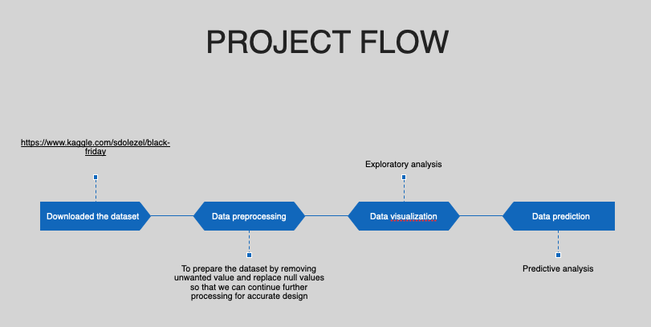

# Black Friday Data Analysis

This project involves the analysis of Black Friday sales data to explore purchasing behavior and build predictive models for sales outcomes as part of data analytics course project in VIT.

## Key Features
- **Data Cleaning & Preprocessing**: Handled missing values, outliers, and inconsistencies for better data quality.
- **Exploratory Data Analysis (EDA)**: Identified patterns and trends in customer behavior.
- **Predictive Modeling**: Developed decision trees, random forests, and polynomial regression models for accurate sales predictions.
- **Multiple Regression Analysis**: Analyzed the impact of key variables on sales with prediction intervals.
- **Visualization**: Created insightful visualizations to present data and model outcomes.

## Tools & Technologies
- **R**: Used for data analysis, visualization, and modeling.
- **Libraries**: `ggplot2`, `caret`, `randomForest`

## Workflow


## How to Run
1. Clone the repository:  
```bash 
   `git clone https://github.com/thevoid12/blackfriday-sales-prediction-and-exploratory-analysis.git`
   ```
2. Open the project in RStudio or any R IDE and download the dataset from this same repo.
3. Run the scripts for cleaning, EDA, and model building.

## Results
-  All the results are documented in final_ppt.pptx ppt file which is also available in this same repo


